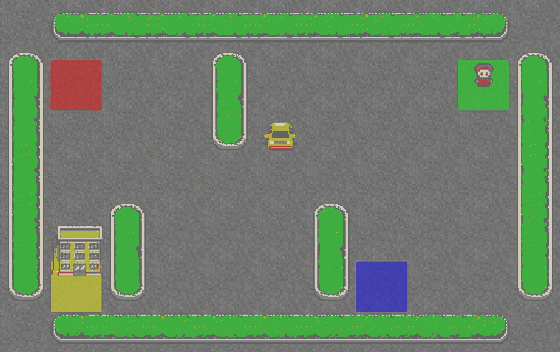
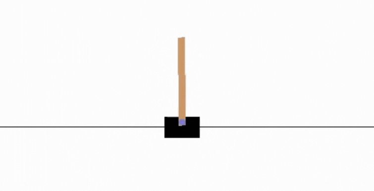

# This repository is to add all the content for RL that I am currently learning and experimenting with

This repository contains the Deep Reinforcement Learning Course mdx files and notebooks. **The website is here**: https://huggingface.co/deep-rl-course/unit0/introduction?fw=pt

 
 
 
 

The syllabus 📚: https://simoninithomas.github.io/deep-rl-course

## The Syllabus 🏗️
This course is **self-paced** you can start when you want 🥳.

| 📆 Publishing date  | 📘 Unit           | 👩‍💻 Hands-on |
|---------------|----------------------------------------------------------|----------------------------------------------------------------------------------------------------------|
| [Published 🥳](https://github.com/huggingface/deep-rl-class/tree/main/unit1#unit-1-introduction-to-deep-reinforcement-learning)  | [An Introduction to Deep Reinforcement Learning](https://github.com/huggingface/deep-rl-class/tree/main/unit1)           | [Train a Deep Reinforcement Learning lander agent to land correctly on the Moon 🌕 using Stable-Baselines3](https://github.com/huggingface/deep-rl-class/blob/main/unit1/unit1.ipynb) |
| [Published 🥳](https://github.com/huggingface/deep-rl-class/tree/main/unit1/unit1-bonus) | [Bonus](https://github.com/huggingface/deep-rl-class/tree/main/unit1/unit1-bonus)                                                    |                                                               |
| [Published 🥳](https://github.com/huggingface/deep-rl-class/blob/main/unit2/README.md)| [Q-Learning](https://github.com/huggingface/deep-rl-class/blob/main/unit2/README.md)                                               | [Train an agent to cross a Frozen lake ⛄ and train an autonomous taxi 🚖](https://github.com/huggingface/deep-rl-class/blob/main/unit2/unit2.ipynb).                                                                                                        |
| [Published 🥳](https://github.com/huggingface/deep-rl-class/tree/main/unit3#unit-3-deep-q-learning-with-atari-games-) | [Deep Q-Learning](https://github.com/huggingface/deep-rl-class/tree/main/unit3#unit-3-deep-q-learning-with-atari-games-)                      | Train a Deep Q-Learning agent to play Space Invaders using [RL-Baselines3-Zoo](https://github.com/DLR-RM/rl-baselines3-zoo)                                                    |
| [Published 🥳](https://github.com/huggingface/deep-rl-class/blob/main/unit3/bonus.md)| [Bonus: Automatic Hyperparameter Tuning using Optuna](https://github.com/huggingface/deep-rl-class/blob/main/unit3/bonus.md)| |                         |                                                    |
| [Published 🥳](https://github.com/huggingface/deep-rl-class/tree/main/unit4#unit-4-an-introduction-to-unity-mlagents-with-hugging-face-) | [🎁 Learn to train your first Unity MLAgent](https://github.com/huggingface/deep-rl-class/tree/main/unit4#unit-4-an-introduction-to-unity-mlagents-with-hugging-face-) | [Train a curious agent to destroy Pyramids 💥](https://colab.research.google.com/github/huggingface/deep-rl-class/blob/main/unit4/unit4.ipynb)  |
| [Published 🥳](https://github.com/huggingface/deep-rl-class/tree/main/unit5#unit-5-policy-gradient-with-pytorch) | [Policy Gradient with PyTorch](https://huggingface.co/blog/deep-rl-pg)                                     | [Code a Reinforce agent from scratch using PyTorch and train it to play Pong 🎾, CartPole and Pixelcopter 🚁](https://colab.research.google.com/github/huggingface/deep-rl-class/blob/main/unit5/unit5.ipynb)                                       |
| [Published 🥳](https://github.com/huggingface/deep-rl-class/tree/main/unit6#towards-better-explorations-methods-with-curiosity) | [Towards better explorations methods with Curiosity](https://github.com/huggingface/deep-rl-class/tree/main/unit6#towards-better-explorations-methods-with-curiosity)|                                                                                                         |
| [Published 🥳](https://github.com/huggingface/deep-rl-class/tree/main/unit7#unit-7-advantage-actor-critic-a2c-using-robotics-simulations-with-pybullet-) | [Advantage Actor Critic (A2C)](https://github.com/huggingface/deep-rl-class/tree/main/unit7#unit-7-advantage-actor-critic-a2c-using-robotics-simulations-with-pybullet-) | [Train a bipedal walker and a spider to learn to walk using A2C](https://github.com/huggingface/deep-rl-class/tree/main/unit7#unit-7-advantage-actor-critic-a2c-using-robotics-simulations-with-pybullet-)                                                                                                        |
| [Published 🥳](https://github.com/huggingface/deep-rl-class/tree/main/unit8#unit-8-proximal-policy-optimization-ppo-with-pytorch) | [Proximal Policy Optimization (PPO)](https://github.com/huggingface/deep-rl-class/tree/main/unit8#unit-8-proximal-policy-optimization-ppo-with-pytorch)                       | [Code a PPO agent from scratch using PyTorch and bulletproof it with Classical Control Environments](https://colab.research.google.com/github/huggingface/deep-rl-class/blob/main/unit8/unit8.ipynb)                                                                                                           |
| [Published 🥳](https://github.com/huggingface/deep-rl-class/tree/main/unit9#unit-9-decision-transformers-and-offline-reinforcement-learning-) | [Decision Transformers and offline Reinforcement Learning](https://github.com/huggingface/deep-rl-class/tree/main/unit9#unit-9-decision-transformers-and-offline-reinforcement-learning-) |  [Train your first Offline Decision Transformer model from scratch to make a half-cheetah run ](https://github.com/huggingface/blog/blob/main/notebooks/101_train-decision-transformers.ipynb)                                                                                                        |

## The library you'll learn during this course
- [RLlib](https://docs.ray.io/en/latest/rllib/index.html)
- [Sample Factory](https://github.com/alex-petrenko/sample-factory)
- [Hugging Face Decision Transformers](https://huggingface.co/blog/decision-transformers)

### Custom environments made by the Hugging Face Team using Unity and Godot

| Environment     | Screenshot                                       |
|-----------------|--------------------------------------------------|
| Huggy the Doggo 🶠(Based on [Unity's Puppo the Corgi work](https://blog.unity.com/technology/puppo-the-corgi-cuteness-overload-with-the-unity-ml-agents-toolkit)) |  |
| SnowballFight ☃️ 👉 Play it here: https://huggingface.co/spaces/ThomasSimonini/SnowballFight |  |

### Gym classic and controls environments 🕹️

| Environment     | Screenshot                                       |
|-----------------|--------------------------------------------------|
| Lunar Lander 🚀🌙 |  |
| Frozen Lake ⛄   |  |
| Taxi 🚖          |  |
| Cartpole          |  |
| Pong 🾠        |  |
| Pixelcopter 🚠      |  |

### Gym Atari environments 👾

| Environment     | Screenshot                                       |
|-----------------|--------------------------------------------------|
| Space Invaders 👾 |  |
| Breakout  |  |
| Qbert         |  |
| Seaquest        |  |

### PyBullet 🤖

| Environment     | Screenshot                                       |
|-----------------|--------------------------------------------------|
| Ant Bullet |  |
| Walker 2D Bullet         |  |

